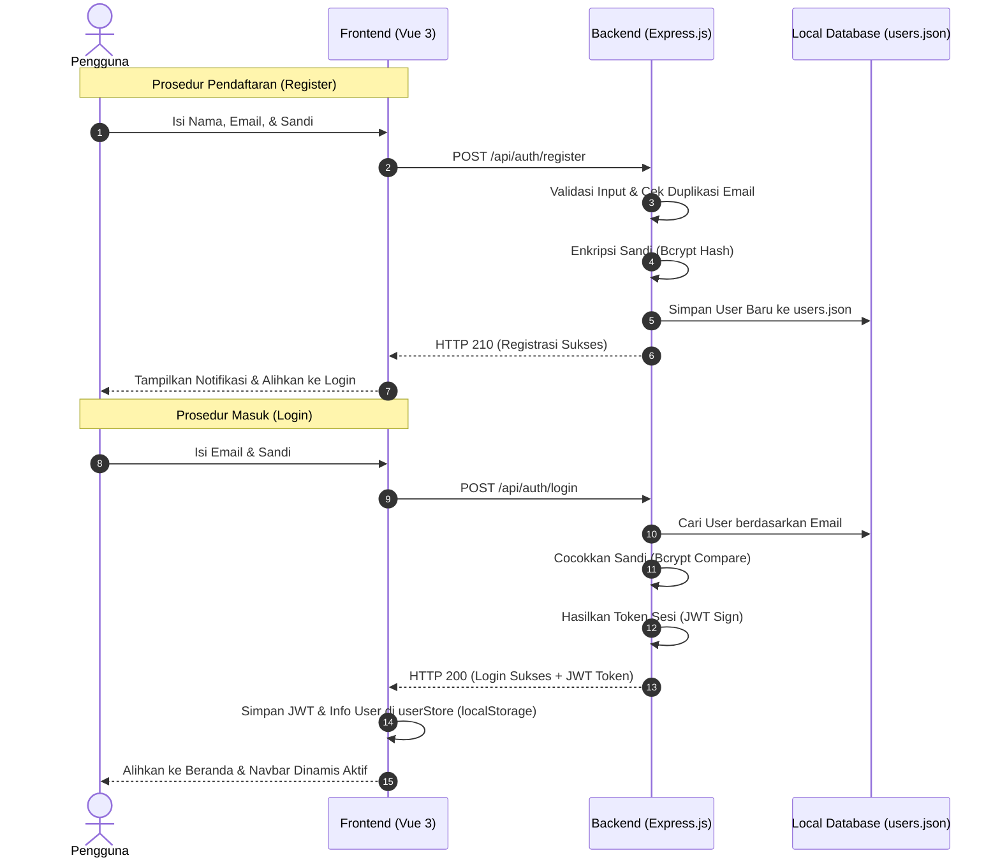

# 📝 Dokumentasi Teknis Sistem Autentikasi e-BuildPC

Dokumen ini berisi penjelasan teknis mendalam mengenai sistem autentikasi terintegrasi (*Client-Server*) yang telah dibangun untuk aplikasi **e-BuildPC**. Dokumentasi ini mencakup daftar berkas yang dikembangkan, teknologi yang digunakan, spesifikasi REST API, serta cara menjalankan dan mengujinya.

---

## 🔄 Aliran Arsitektur Autentikasi (JWT & Bcrypt)

Berikut adalah diagram alir interaksi antara antarmuka pengguna (Frontend Vue 3) dengan server API (Backend Express.js) menggunakan enkripsi kata sandi *Bcrypt* dan token sesi *JSON Web Tokens (JWT)*:



---

## 🛠️ Apa Saja yang Telah Dibuat?

Integrasi penuh ini melibatkan pembuatan folder backend baru serta modifikasi reaktif pada berkas-berkas frontend yang telah ada:

### 1. Sisi Backend Express.js (Folder `/backend`)
*   **`backend/package.json`**: Mengonfigurasi dependensi server, tipe modul ES (`"type": "module"`), dan skrip live-reload dev.
*   **`backend/.env` & `.env.example`**: Konfigurasi port server (3000) dan kunci enkripsi sesi JWT rahasia.
*   **`backend/server.js`**: File *entrypoint* utama server yang menginisialisasi Express, mengaktifkan proteksi CORS, mem-parsing body JSON, melakukan logging request, serta memetakan router.
*   **`backend/data/users.json`**: *Flat-file database* lokal berbasis JSON yang bertugas menyimpan records user terdaftar dengan password terenkripsi.
*   **`backend/middleware/auth.js`**: Middleware proteksi untuk mengekstrak token `Bearer` dari header `Authorization` dan men-decode isinya.
*   **`backend/routes/auth.js`**: Berisi seluruh logika pemrosesan rute autentikasi (Registrasi, Login, dan pencocokan data profil `/me`).

### 2. Sisi Frontend Vue 3 (Folder `/src`)
*   **`src/store.js`**: Ditambahkan objek reaktif global **`userStore`** yang menyimpan status sesi user saat ini (`isLoggedIn`, `user`, `token`) serta metode pembantu `login()` dan `logout()`.
*   **`src/views/RegisterPage.vue`**: Menghubungkan fungsi formulir registrasi untuk melakukan request API `POST` ke backend, lengkap dengan penanganan status *loading* tombol dan popup notifikasi.
*   **`src/views/LoginPage.vue`**: Menghubungkan fungsi formulir login untuk memanggil API backend, merekam JWT token ke store reaktif global, dan mengalihkan pengguna ke Beranda.
*   **`src/components/NavBar.vue`**: Menghubungkan tampilan navbar agar reaktif terhadap status login di `userStore` (Menampilkan nama pengguna terdaftar serta tombol **Keluar / Logout** jika sudah masuk).

---

## 📦 Apa Saja Teknologi yang Digunakan?

### Backend Dependencies (Node.js)
*   **`express`** (^4.19.2): Web framework utama untuk membangun REST API endpoints secara cepat dan modular.
*   **`cors`** (^2.8.5): Middleware untuk mengizinkan permintaan lintas domain (*Cross-Origin Resource Sharing*) agar frontend di port 5173 bisa mengakses backend di port 3000 tanpa hambatan browser.
*   **`bcryptjs`** (^2.4.3): Algoritma *hashing* satu arah untuk mengamankan kata sandi pengguna sebelum disimpan ke database.
*   **`jsonwebtoken`** (^9.0.2): Pustaka pembuatan token berbasis JWT untuk otentikasi sesi *stateless* yang aman dan ringan.
*   **`dotenv`** (^16.4.5): Untuk memisahkan konfigurasi sensitif (seperti port dan kunci keamanan) ke berkas `.env` eksternal.
*   **`nodemon`** (^3.1.0) *(Dev Dependency)*: Utilitas yang memantau perubahan berkas backend dan otomatis me-restart server selama tahap pengembangan.

---

## 📋 Spesifikasi REST API Endpoints

### 1. Health Check
*   **Endpoint**: `GET /api/health`
*   **Fungsi**: Memastikan server backend aktif dan berjalan lancar.
*   **Format Response (JSON)**:
    ```json
    {
      "status": "OK",
      "message": "e-BuildPC API Server berjalan dengan lancar!"
    }
    ```

### 2. Registrasi Akun
*   **Endpoint**: `POST /api/auth/register`
*   **Format Request Body (JSON)**:
    ```json
    {
      "fullname": "Imam D.M.",
      "email": "imam@email.com",
      "password": "password123"
    }
    ```
*   **Format Response Sukses (JSON)**:
    ```json
    {
      "message": "Registrasi akun berhasil!",
      "user": {
        "user_id": 1,
        "name": "Imam D.M.",
        "email": "imam@email.com",
        "username": "imam",
        "role": "user"
      }
    }
    ```

### 3. Login Akun
*   **Endpoint**: `POST /api/auth/login`
*   **Format Request Body (JSON)**:
    ```json
    {
      "email": "imam@email.com",
      "password": "password123"
    }
    ```
*   **Format Response Sukses (JSON)**:
    ```json
    {
      "message": "Login berhasil!",
      "token": "eyJhbGciOiJIUzI1NiIsInR5cCI6IkpXVCJ9...",
      "user": {
        "user_id": 1,
        "name": "Imam D.M.",
        "email": "imam@email.com",
        "role": "user"
      }
    }
    ```

### 4. Detail Akun Aktif (Protected Route)
*   **Endpoint**: `GET /api/auth/me`
*   **Headers**: `Authorization: Bearer <JWT_TOKEN_ANDA>`
*   **Format Response Sukses (JSON)**:
    ```json
    {
      "user": {
        "user_id": 1,
        "name": "Imam D.M.",
        "email": "imam@email.com",
        "username": "imam",
        "role": "user",
        "exp": 1780000000
      }
    }
    ```

---

## 🚀 Cara Menjalankan & Menggunakan

Ikuti panduan langkah demi langkah berikut untuk memasang dan menjalankan sistem di laptop Anda atau laptop rekan satu tim:

### A. Persiapan Awal
1.  Buka terminal Anda, lalu pastikan Anda masuk ke dalam direktori `/backend`:
    ```bash
    cd backend
    ```
2.  Pasang seluruh pustaka dependensi yang dibutuhkan:
    ```bash
    npm install
    ```
3.  Pastikan berkas `.env` sudah terisi dengan benar (sesuai panduan `.env.example`).

### B. Menjalankan Server Backend
1.  Di terminal backend, jalankan perintah development:
    ```bash
    npm run dev
    ```
2.  Server akan aktif di `http://localhost:3000` dan otomatis memuat ulang (*hot-reload*) jika Anda mengubah baris kode.

### C. Menjalankan Server Frontend
1.  Buka terminal baru di root direktori project, lalu jalankan frontend Vue 3 Anda:
    ```bash
    npm run dev
    ```
2.  Buka aplikasi di peramban browser via `http://localhost:5173`.

### D. Menguji Sistem Autentikasi
1.  Akses halaman pendaftaran pada `http://localhost:5173/register`.
2.  Masukkan data akun uji coba baru, klik **Buat Akun**. Pengguna akan otomatis diarahkan ke formulir masuk.
3.  Buka berkas `backend/data/users.json` untuk memverifikasi bahwa akun Anda berhasil tercatat dengan kata sandi terenkripsi.
4.  Masukkan email dan kata sandi di formulir masuk, klik **Masuk**.
5.  Perhatikan pojok kanan atas navigasi navbar Anda: nama akun sukses ditampilkan secara dinamis beserta tombol keluar 🚪.

---

## 📋 Fitur yang Masih Perlu Diimplementasikan (Future Backlog)

Untuk menyempurnakan aplikasi e-BuildPC menjadi platform siap produksi yang lengkap, berikut adalah daftar fitur backend dan integrasi lanjutan yang masih perlu Anda bangun di fase berikutnya:

### 1. Migrasi ke Database Relasional Asli (SQL)
*   **Deskripsi**: Mengganti berkas penyimpanan lokal `users.json` dengan database relasional nyata (MySQL atau PostgreSQL).
*   **Langkah**: Menyiapkan skema tabel menggunakan ORM seperti **Prisma** atau **Sequelize**, membuat migrasi database (`npx prisma migrate dev`), dan mengalihkan penulisan data di rute autentikasi ke database SQL.

### 2. API Katalog & Pencarian Komponen PC (`GET /api/products`)
*   **Deskripsi**: Membaca basis data produk dari database SQL untuk disajikan secara dinamis pada halaman **Katalog** (`KatalogPage.vue`).
*   **Spesifikasi**: Harus mendukung penyaringan reaktif berdasarkan kategori (Processor, GPU, RAM, dll.), pencarian berbasis teks (`LIKE` query), dan pengurutan (*sorting*) berdasarkan harga terendah, tertinggi, atau rating terbaik.

### 3. API Keranjang Belanja Persisten (`/api/cart`)
*   **Deskripsi**: Menyimpan isi keranjang belanja pengguna terautentikasi langsung ke database.
*   **Manfaat**: Mencegah hilangnya barang belanjaan di keranjang saat pengguna melakukan refresh browser atau mengakses dari perangkat berbeda.

### 4. API Checkout, Transaksi, & Invoice WhatsApp (`POST /api/orders/checkout`)
*   **Deskripsi**: Memproses pesanan akhir dari keranjang belanja.
*   **Logika Bisnis**:
    *   Mengurangi jumlah stok barang di database secara aman (*Database Transaction*).
    *   Menghasilkan tautan invoice otomatis yang memformat pesan WhatsApp (menyebutkan daftar barang dan total biaya) dan mengalihkan pembeli untuk melakukan konfirmasi langsung ke nomor WhatsApp admin toko.

### 5. Integrasi Backend AI Chat Assistant (`POST /api/chat`)
*   **Deskripsi**: Menghubungkan chatbot melayang di pojok kanan bawah dengan mesin kecerdasan buatan (AI) di backend.
*   **Langkah**: Membuat rute Express yang meneruskan riwayat percakapan pengguna ke API lokal **Ollama (Llama 3 / Mistral)** atau cloud API (Gemini API) untuk memberikan rekomendasi spesifikasi rakitan PC secara cerdas dan interaktif.

### 6. Peningkatan Keamanan & Route Guards (Frontend)
*   **Deskripsi**: Memproteksi rute sensitif di sisi frontend Vue.
*   **Langkah**: Memodifikasi Router Navigation Guards di `src/main.js` menggunakan properti metadata (`meta: { requiresAuth: true }`) untuk mencegah pengguna tidak dikenal mengakses halaman keranjang belanja (`/cart`) sebelum masuk ke akun mereka.

