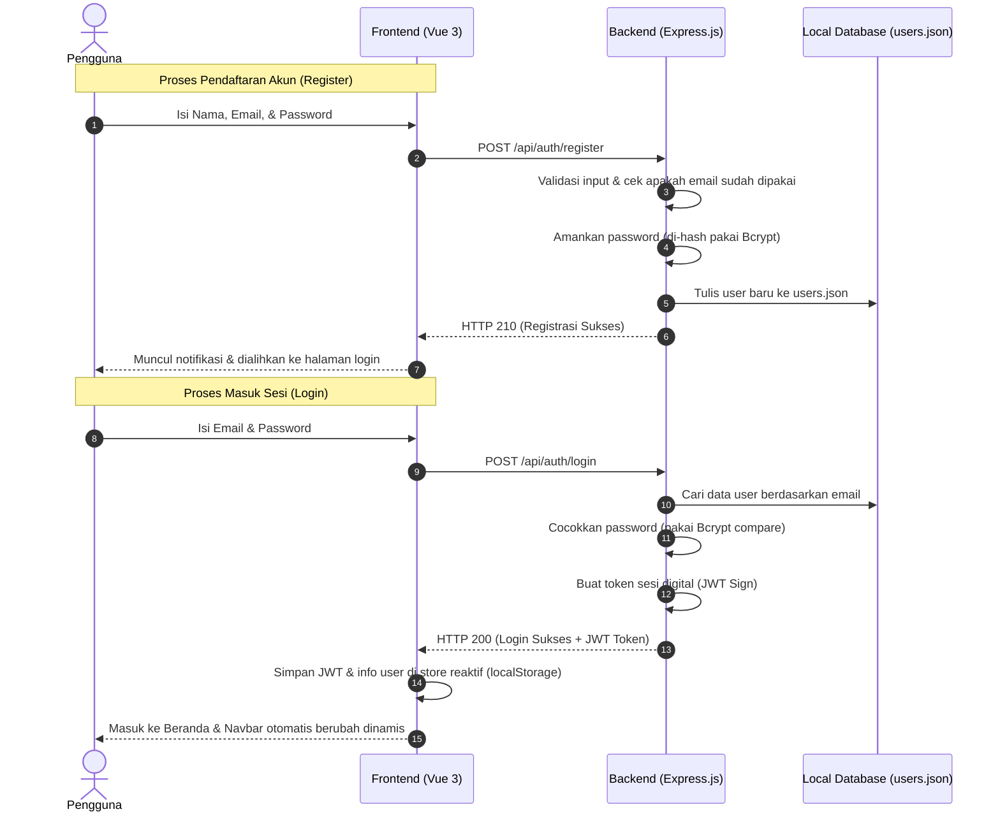

## 🔄 Aliran Kerja Autentikasi (JWT & Bcrypt)

Diagram interaksi antara frontend (Vue 3) dan backend (Express.js) saat proses registrasi dan login berlangsung:



---

## 🛠️ Apa Saja yang Sudah Dibuat?

### 1. Sisi Backend Express.js (Ada di folder `/backend`)
*   **`backend/package.json`**: Tempat mengatur pustaka/pacakge yang dipakai, menyetel ES Modules (`"type": "module"`), dan membuat perintah cepat start/dev.
*   **`backend/.env` & `.env.example`**: Konfigurasi port (3000) dan kunci enkripsi JWT rahasia kita.
*   **`backend/server.js`**: Gerbang utama server Express. Di sini kita menyetel middleware CORS (biar frontend bisa akses backend), parser JSON, logger request, dan rute API.
*   **`backend/data/users.json`**: Database lokal sederhana berbasis berkas JSON untuk menyimpan data pengguna terdaftar beserta password-nya yang sudah terenkripsi aman.
*   **`backend/middleware/auth.js`**: Filter keamanan untuk memeriksa dan membaca token JWT yang dikirim oleh frontend di header request.
*   **`backend/routes/auth.js`**: Berisi seluruh logika rute autentikasi (mulai dari register, login, sampai validasi profil user aktif `/me`).

### 2. Sisi Frontend Vue 3 (Ada di folder `/src`)
*   **`src/store.js`**: Kita tambahkan objek reaktif **`userStore`** agar seluruh halaman frontend bisa tahu status login pengguna secara instan (`isLoggedIn`, `user`, `token`).
*   **`src/views/RegisterPage.vue`**: Form registrasi sekarang langsung mengirim request `POST` ke backend, lengkap dengan animasi tombol loading dan notifikasi sukses/gagal.
*   **`src/views/LoginPage.vue`**: Form masuk terhubung ke API backend, menyimpan token masuk ke `userStore`, lalu mengalihkan pengguna ke halaman Beranda.
*   **`src/components/NavBar.vue`**: Desain tombol akun di kanan atas sekarang reaktif! Kalau belum login muncul tombol **"Login"**, dan kalau sudah login otomatis berubah jadi **"Halo, [Nama Pengguna] 🚪 Keluar"**.

---

## 📦 Teknologi yang Digunakan

### Dependensi Backend (Node.js)
*   **`express`**: Framework web minimalis andalan untuk membuat rute API secara cepat dan rapi.
*   **`cors`**: Middleware wajib biar browser mengizinkan frontend kita (port 5173) mengambil data dari backend kita (port 3000).
*   **`bcryptjs`**: Algoritma enkripsi satu arah untuk menyamarkan password user agar database kita aman dari kebocoran data.
*   **`jsonwebtoken`**: Pustaka pembuat token JWT rahasia sebagai penanda sesi masuk yang ringan dan aman.
*   **`dotenv`**: Pustaka untuk mengamankan konfigurasi sensitif ke file `.env` terpisah agar tidak tidak sengaja ter-upload ke Git.
*   **`nodemon`** *(Dev Tool)*: Asisten otomatis yang memantau perubahan kode backend dan otomatis me-restart server sendiri biar kita tidak perlu restart manual.

---

## 📋 Detail REST API Endpoints

### 1. Cek Kesehatan Server
*   **Endpoint**: `GET /api/health`
*   **Fungsi**: Memastikan server backend menyala dan berjalan normal.
*   **Contoh Response (JSON)**:
    ```json
    {
      "status": "OK",
      "message": "e-BuildPC API Server berjalan lancar!"
    }
    ```

### 2. Pendaftaran Akun Baru (Register)
*   **Endpoint**: `POST /api/auth/register`
*   **Contoh Request Body (JSON)**:
    ```json
    {
      "fullname": "Imam D.M.",
      "email": "imam@email.com",
      "password": "password123"
    }
    ```
*   **Contoh Response Sukses (JSON)**:
    ```json
    {
      "message": "Registrasi akun berhasil!",
      "user": {
        "user_id": 1,
        "name": "Imam D.M.",
        "email": "imam@email.com",
        "username": "imam",
        "role": "user"
      }
    }
    ```

### 3. Masuk ke Akun (Login)
*   **Endpoint**: `POST /api/auth/login`
*   **Contoh Request Body (JSON)**:
    ```json
    {
      "email": "imam@email.com",
      "password": "password123"
    }
    ```
*   **Contoh Response Sukses (JSON)**:
    ```json
    {
      "message": "Login berhasil!",
      "token": "eyJhbGciOiJIUzI1NiIsInR5cCI6IkpXVCJ9...",
      "user": {
        "user_id": 1,
        "name": "Imam D.M.",
        "email": "imam@email.com",
        "role": "user"
      }
    }
    ```

### 4. Ambil Data Pengguna Aktif (Protected Route)
*   **Endpoint**: `GET /api/auth/me`
*   **Header Wajib**: `Authorization: Bearer <TOKEN_JWT_KALIAN>`
*   **Contoh Response Sukses (JSON)**:
    ```json
    {
      "user": {
        "user_id": 1,
        "name": "Imam D.M.",
        "email": "imam@email.com",
        "username": "imam",
        "role": "user",
        "exp": 1780000000
      }
    }
    ```

---

## How-To

### A. Persiapan
1.  Buka terminal baru di VS Code, lalu masuk ke folder backend:
    ```bash
    cd backend
    ```
2.  Instal seluruh paket dependensi yang diperlukan:
    ```bash
    npm install
    ```
3.  Duplikat berkas `.env.example` lalu ubah nama salinannya menjadi **`.env`** di dalam folder backend.

### B. Menyalakan Server Backend
1.  Di terminal backend, jalankan perintah development:
    ```bash
    npm run dev
    ```
2.  Server Express kita sekarang aktif di `http://localhost:3000`. Jika kalian mengedit kode backend, server otomatis memuat ulang sendiri secara instan!

### C. Menyalakan Server Frontend
1.  Buka terminal baru lagi di root folder project, lalu nyalakan frontend Vue 3:
    ```bash
    npm run dev
    ```
2.  Akses aplikasi kalian di browser via alamat: `http://localhost:5173`.

### D. Cara Uji Coba Fitur
1.  Buka halaman pendaftaran di browser via `http://localhost:5173/register`.
2.  Masukkan data akun baru secara bebas, lalu klik **Buat Akun**. Kalian akan otomatis dialihkan ke formulir masuk.
3.  Cek file `backend/data/users.json` di VS Code untuk memastikan akun baru sudah tercatat rapi dengan password berformat hash Bcrypt yang aman.
4.  Masukkan email dan password di formulir masuk, lalu klik **Masuk**.
5. Kalian akan masuk ke Beranda dan cek nama kalian di pojok kanan atas navbar sama tombol keluar 🚪.

---

## 📋 Future Backlog

### 1. Migrasi ke Database SQL Asli (MySQL atau PostgreSQL)
*   **Rencana**: Mengganti database lokal `users.json` dengan database relasional sesungguhnya.
*   **Langkah**: Menyiapkan tabel relasional memakai ORM modern seperti **Prisma** atau **Sequelize**, membuat migrasi database (`npx prisma migrate dev`), dan mengalihkan pembacaan data autentikasi ke database SQL server kita.

### 2. API Katalog & Fitur Pencarian Produk (`GET /api/products`)
*   **Rencana**: Menyajikan data produk dari database ke halaman **Katalog** (`KatalogPage.vue`) secara dinamis.
*   **Fitur**: Mendukung pencarian teks kata kunci, penyaringan per kategori komponen, serta pengurutan (*sorting*) berdasarkan harga dan rating.

### 3. API Keranjang Belanja Persisten (`/api/cart`)
*   **Rencana**: Menyimpan data item di keranjang belanja langsung ke database.
*   **Manfaat**: Biar barang di keranjang belanja user tidak hilang ketika mereka me-refresh browser, logout, atau berganti perangkat (misal dari laptop pindah ke HP).

### 4. API Transaksi, Pengurangan Stok, & Invoice WhatsApp (`POST /api/orders/checkout`)
*   **Rencana**: Mengatur alur belanja akhir (*checkout*).
*   **Logika**: Mengurangi jumlah stok produk di database secara aman (*Database Transaction*) dan otomatis menghasilkan tautan invoice WhatsApp berisi rekap belanjaan untuk dikirim langsung ke admin toko.

### 5. API Obrolan Asisten AI Rakitan PC (`POST /api/chat`)
*   **Rencana**: Menghidupkan fitur asisten AI melayang di pojok kanan bawah.
*   **Langkah**: Membuat rute backend Express yang menghubungkan chat pengguna ke API AI lokal **Ollama (Llama 3 / Mistral)** atau cloud API (Gemini API) untuk memberikan rekomendasi spesifikasi PC rakitan secara interaktif.

### 6. Peningkatan Keamanan & Proteksi Rute (Frontend Navigation Guards)
*   **Rencana**: Memproteksi halaman-halaman penting di frontend.
*   **Langkah**: Mengedit konfigurasi router di `src/main.js` agar pengguna yang belum login/tidak dikenal otomatis tertolak dan dialihkan ke halaman login saat mencoba mengakses halaman penting seperti keranjang belanja (`/cart`).
